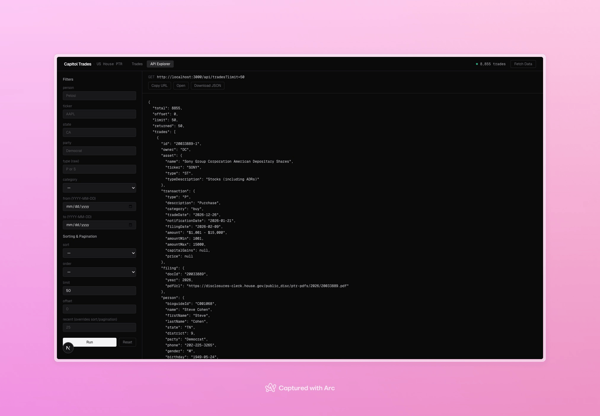

# Capitol API Frontend

Very simple frontend component for [Capitol API](https://github.com/crnicholson/capitol-api) to view data. 


## API builder

If you want to play around with the API and learn how to use it, you can use this to build API queries. 



## Usage

Run:

```
git clone https://github.com/crnicholson/capitol-api.git
cd capitol-api
npm install
npm start
```

Next, in a new terminal:

```
git clone https://github.com/crnicholson/capitol-api-frontend.git
cd capitol-api-frontend
npm install
npm run dev
```

Then, you should be able to access the website at `http://localhost:3001` with the server running on `http://localhost:3000`.
